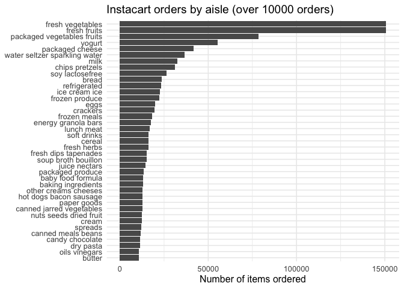
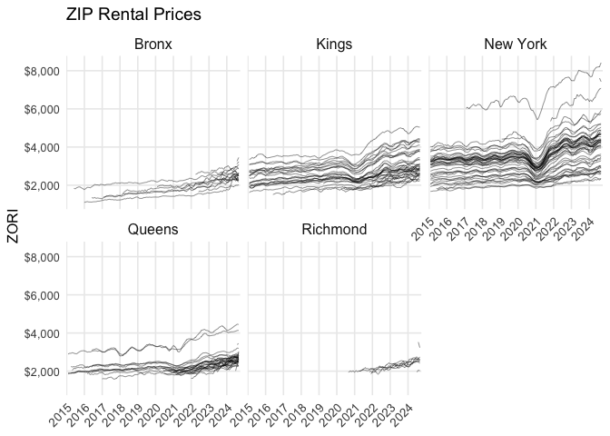
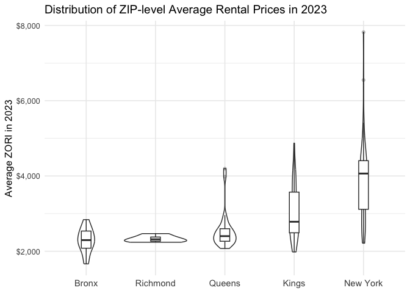
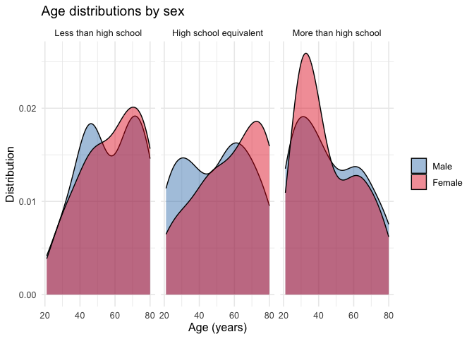
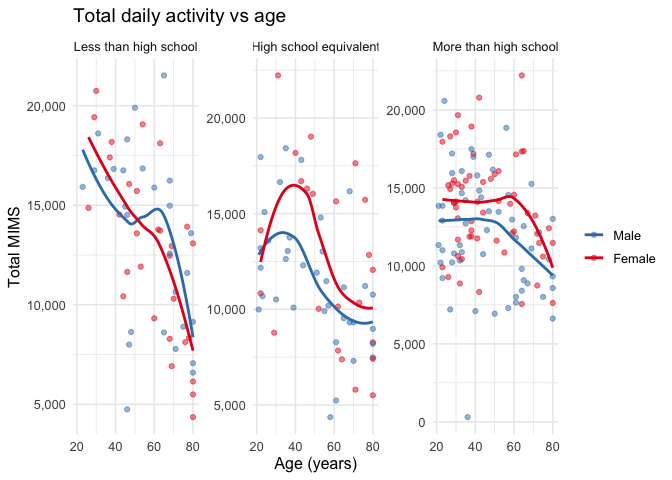
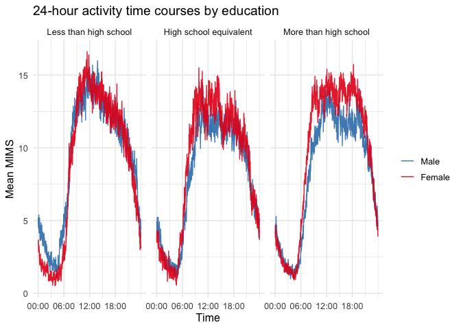

p8105_hw3_yw4664
================
Yijun Wang
2025-10-07

## Problem 1

### Loading Libraries

``` r
library(tidyverse)

library(janitor)

library(knitr)

library(ggplot2)

library(p8105.datasets)

data("instacart")
```

### 1. Short description of the dataset

``` r
nrow(instacart); ncol(instacart)
```

    ## [1] 1384617

    ## [1] 15

``` r
glimpse(instacart)
```

    ## Rows: 1,384,617
    ## Columns: 15
    ## $ order_id               <int> 1, 1, 1, 1, 1, 1, 1, 1, 36, 36, 36, 36, 36, 36,…
    ## $ product_id             <int> 49302, 11109, 10246, 49683, 43633, 13176, 47209…
    ## $ add_to_cart_order      <int> 1, 2, 3, 4, 5, 6, 7, 8, 1, 2, 3, 4, 5, 6, 7, 8,…
    ## $ reordered              <int> 1, 1, 0, 0, 1, 0, 0, 1, 0, 1, 0, 1, 1, 1, 1, 1,…
    ## $ user_id                <int> 112108, 112108, 112108, 112108, 112108, 112108,…
    ## $ eval_set               <chr> "train", "train", "train", "train", "train", "t…
    ## $ order_number           <int> 4, 4, 4, 4, 4, 4, 4, 4, 23, 23, 23, 23, 23, 23,…
    ## $ order_dow              <int> 4, 4, 4, 4, 4, 4, 4, 4, 6, 6, 6, 6, 6, 6, 6, 6,…
    ## $ order_hour_of_day      <int> 10, 10, 10, 10, 10, 10, 10, 10, 18, 18, 18, 18,…
    ## $ days_since_prior_order <int> 9, 9, 9, 9, 9, 9, 9, 9, 30, 30, 30, 30, 30, 30,…
    ## $ product_name           <chr> "Bulgarian Yogurt", "Organic 4% Milk Fat Whole …
    ## $ aisle_id               <int> 120, 108, 83, 83, 95, 24, 24, 21, 2, 115, 53, 1…
    ## $ department_id          <int> 16, 16, 4, 4, 15, 4, 4, 16, 16, 7, 16, 4, 16, 2…
    ## $ aisle                  <chr> "yogurt", "other creams cheeses", "fresh vegeta…
    ## $ department             <chr> "dairy eggs", "dairy eggs", "produce", "produce…

``` r
sample_n(instacart, 5)
```

    ## # A tibble: 5 × 15
    ##   order_id product_id add_to_cart_order reordered user_id eval_set order_number
    ##      <int>      <int>             <int>     <int>   <int> <chr>           <int>
    ## 1  2522000      24184                 7         0  145309 train               7
    ## 2  1236987      13237                 3         1  156608 train              21
    ## 3  2295260      38689                 2         1   21007 train              12
    ## 4  2592809      36076                 6         1   27931 train              25
    ## 5  2924664      35762                 8         1   20742 train              12
    ## # ℹ 8 more variables: order_dow <int>, order_hour_of_day <int>,
    ## #   days_since_prior_order <int>, product_name <chr>, aisle_id <int>,
    ## #   department_id <int>, aisle <chr>, department <chr>

The instacart dataset has 1,384,617 rows and 15 variables. Every row is
a product added to an order.

Key variables include the info (order_id, user_id, order_number), timing
(order_dow 0–6, order_hour_of_day 0–23, days_since_prior_order), product
data (product_id, product_name, aisle_id/aisle,
department_id/department), and cart related info (add_to_cart_order,
reordered).

For example, there’s an order_id = 1 (user 112108’s 4th order), placed
on day 4 at 10:00, contains 8 items such as Bulgarian Yogurt and several
fresh vegetables, with some marked as reordered = 1.

### 2. How many aisles are there, and which aisles are the most items ordered from?

``` r
n_aisles <- n_distinct(instacart$aisle)
n_aisles
```

    ## [1] 134

``` r
aisle_counts <- instacart |> 
  count(aisle, sort = TRUE)

head(aisle_counts, 10) |> 
  kable(col.names = c("Aisle", "Number of items ordered"))
```

| Aisle                         | Number of items ordered |
|:------------------------------|------------------------:|
| fresh vegetables              |                  150609 |
| fresh fruits                  |                  150473 |
| packaged vegetables fruits    |                   78493 |
| yogurt                        |                   55240 |
| packaged cheese               |                   41699 |
| water seltzer sparkling water |                   36617 |
| milk                          |                   32644 |
| chips pretzels                |                   31269 |
| soy lactosefree               |                   26240 |
| bread                         |                   23635 |

There are `134` aisles; the top 3 largest are the fresh vegetables,
fresh fruits and packaged vegetables fruits aisles.

### 3. Plot showing the number of items ordered in each aisle

``` r
aisle_counts |> 
  
  filter(n > 10000) |>
  
  mutate(aisle = fct_reorder(aisle, n)) |>
  
  ggplot(aes(x = aisle, y = n)) +
  
  geom_col() +
  
  coord_flip() +
  
  labs(x = NULL, y = "Number of items ordered",
       title = "Instacart orders by aisle (over 10000 orders)") +
  
  theme_minimal(base_size = 12)
```

<!-- -->

### 4. Table showing the three most popular items in each of the aisles “baking ingredients”, “dog food care”, and “packaged vegetables fruits”

``` r
top3_table <- instacart |>
  
  filter(aisle %in% c("baking ingredients",
                      "dog food care",
                      "packaged vegetables fruits")) |>
  
  count(aisle, product_name, sort = TRUE) |>
  
  group_by(aisle) |>
  
  slice_max(n, n = 3, with_ties = FALSE) |>
  
  ungroup() |>
  
  arrange(aisle, desc(n))

kable(
  top3_table,
  format = "pipe",
  col.names = c("Aisle", "Product", "Times ordered"),
  caption = "Top 3 products in three aisles",
  align = c("l","l","c")
)
```

| Aisle | Product | Times ordered |
|:---|:---|:--:|
| baking ingredients | Light Brown Sugar | 499 |
| baking ingredients | Pure Baking Soda | 387 |
| baking ingredients | Cane Sugar | 336 |
| dog food care | Snack Sticks Chicken & Rice Recipe Dog Treats | 30 |
| dog food care | Organix Chicken & Brown Rice Recipe | 28 |
| dog food care | Small Dog Biscuits | 26 |
| packaged vegetables fruits | Organic Baby Spinach | 9784 |
| packaged vegetables fruits | Organic Raspberries | 5546 |
| packaged vegetables fruits | Organic Blueberries | 4966 |

Top 3 products in three aisles

### 5. Table showing the mean hour of the day at which Pink Lady Apples and Coffee Ice Cream are ordered on each day of the week

``` r
days <- c("Sun","Mon","Tue","Wed","Thu","Fri","Sat")

mean_hour_tbl <- instacart |>
  filter(product_name %in% c("Pink Lady Apples", "Coffee Ice Cream")) |>
  
  mutate(day = factor(order_dow, levels = 0:6, labels = days)) |>
  
  group_by(product_name, day) |>
  
  summarize(mean_hour = mean(order_hour_of_day), .groups = "drop") |>
  
  mutate(mean_hour = round(mean_hour, 2)) |>
  
  pivot_wider(names_from = day, values_from = mean_hour)


kable(
  mean_hour_tbl,
  format = "pipe",
  col.names = c("", days),
  caption = "Mean order hour by each day",
  align = c("l", rep("c", length(days)))
)
```

|                  |  Sun  |  Mon  |  Tue  |  Wed  |  Thu  |  Fri  |  Sat  |
|:-----------------|:-----:|:-----:|:-----:|:-----:|:-----:|:-----:|:-----:|
| Coffee Ice Cream | 13.77 | 14.32 | 15.38 | 15.32 | 15.22 | 12.26 | 13.83 |
| Pink Lady Apples | 13.44 | 11.36 | 11.70 | 14.25 | 11.55 | 12.78 | 11.94 |

Mean order hour by each day

## Problem 2

### Loading data

``` r
library(tidyverse)

library(lubridate)

library(scales)
```

    ## 
    ## Attaching package: 'scales'

    ## The following object is masked from 'package:purrr':
    ## 
    ##     discard

    ## The following object is masked from 'package:readr':
    ## 
    ##     col_factor

``` r
library(knitr)

library(patchwork)

zip_path  <- "data/zillow_data/Zip Codes.csv"
zori_path <- "data/zillow_data/Zip_zori_uc_sfrcondomfr_sm_month_NYC.csv"

zip_meta <- read_csv(zip_path) |>
  clean_names() |>
  rename(zip = zip_code) |>
  mutate(zip = str_pad(as.character(zip), 5, pad = "0"))
```

    ## Rows: 322 Columns: 7

    ## ── Column specification ────────────────────────────────────────────────────────
    ## Delimiter: ","
    ## chr (4): County, County Code, File Date, Neighborhood
    ## dbl (3): State FIPS, County FIPS, ZipCode
    ## 
    ## ℹ Use `spec()` to retrieve the full column specification for this data.
    ## ℹ Specify the column types or set `show_col_types = FALSE` to quiet this message.

``` r
zori_wide <- read_csv(zori_path) |>
  clean_names() |>
  rename(zip = region_name) |>
  mutate(zip = str_pad(as.character(zip), 5, pad = "0"))
```

    ## Rows: 149 Columns: 125
    ## ── Column specification ────────────────────────────────────────────────────────
    ## Delimiter: ","
    ## chr   (6): RegionType, StateName, State, City, Metro, CountyName
    ## dbl (119): RegionID, SizeRank, RegionName, 2015-01-31, 2015-02-28, 2015-03-3...
    ## 
    ## ℹ Use `spec()` to retrieve the full column specification for this data.
    ## ℹ Specify the column types or set `show_col_types = FALSE` to quiet this message.

``` r
zori_long <- zori_wide |>
  pivot_longer(
    cols = matches("^x\\d{4}_\\d{2}_\\d{2}$"),
    names_to  = "date_raw",
    values_to = "zori"
  ) |>
  mutate(date = ymd(str_replace_all(sub("^x", "", date_raw), "_", "-"))) |>
  select(zip, date, zori)

zori <- zori_long |>
  left_join(zip_meta, by = "zip") |>
  relocate(zip, date, zori)
```

    ## Warning in left_join(zori_long, zip_meta, by = "zip"): Detected an unexpected many-to-many relationship between `x` and `y`.
    ## ℹ Row 4757 of `x` matches multiple rows in `y`.
    ## ℹ Row 256 of `y` matches multiple rows in `x`.
    ## ℹ If a many-to-many relationship is expected, set `relationship =
    ##   "many-to-many"` to silence this warning.

``` r
start_month <- ymd("2015-01-01")
end_month   <- ymd("2024-08-31")

zori_hw3 <- zori |>
  filter(date >= start_month, date <= end_month) |>
  mutate(year  = year(date), month = month(date))
```

### 1. How many ZIP codes are observed 116 times? How many are observed fewer than 10 times? Why are some ZIP codes are observed rarely and others observed in each month?

``` r
zip_counts <- zori_hw3 |>
  filter(!is.na(zori)) |>
  count(zip, name = "n_months")

n_zip_116  <- sum(zip_counts$n_months == 116)
n_zip_lt10 <- sum(zip_counts$n_months < 10)

kable(
  tibble(
    `in all 116 months` = n_zip_116,
    `fewer than 10 months` = n_zip_lt10
  ),
  format = "pipe",
  caption = "ZIPs between Jan 2015 and Aug 2024"
)
```

| in all 116 months | fewer than 10 months |
|------------------:|---------------------:|
|                47 |                   26 |

ZIPs between Jan 2015 and Aug 2024

The reasons are that maybe some ZIPs are business only and rarely have
residential rents, or that Zillow reports a month for a ZIP only when
there’s enough listing signal, thus the conditions of ZIPs observed vary
greatly.

### 2. Plot showing NYC Rental Prices within ZIP codes for all available years

``` r
p_borough <- zori_hw3 |>
  filter(!is.na(county), !is.na(zori)) |>
  ggplot(aes(x = date, y = zori, group = zip)) +
  geom_line(alpha = 0.5, linewidth = 0.3) +          # 只有 ZIP 的线
  facet_wrap(~ county, ncol = 3) +                     # 用 county 分面
  scale_y_continuous(labels = label_dollar()) +
  scale_x_date(
    date_breaks = "1 year",
    date_labels = "%Y",
    expand = expansion(mult = c(0.01, 0.01)),
    guide  = guide_axis(angle = 45, check.overlap = TRUE)
  ) +
  labs(title = "ZIP Rental Prices",
       x = NULL, y = "ZORI") +
  theme_minimal(base_size = 12) +
  theme(
    axis.text.x = element_text(size = 10),
    strip.text  = element_text(size = 12),
    panel.grid.minor = element_blank()
  )

p_borough
```

<!-- -->

Manhattan has the highest overall rents throughout all boroughs. It also
has widest spread across ZIPs. There’s a sharp 2020–2021 dip with the
strongest rebound, and some ZIPs \> \$6–8k by 2024. The ZIP with the
highest rental prices is, surprisingly, 10007 (Tribeca), which partly
contridicts my expectation.

Brooklyn has the second highest rents, with gentle rise in 2015–2019, a
small pandemic dip, then a steep climb after 2021. The within-borough
spread is moderate.

Queens has a similar shape to Brooklyn but a bit lower. There are 2
high-end ZIP outliers pushing above \$4k by 2023–2024, which are both in
Long Island City (where I am living in..).

Bronx has the lowest level overall, and has a tight band of ZIPs. It has
a steady gradual increase and minimal dip.

Staten Island also has a low level and a sparser coverage. It has very
mild upward trend and a small spread.

### 3. Average rental price within each ZIP code over each month in 2023

``` r
zip_2023_mean <- zori_hw3 |>
  filter(year(date) == 2023, !is.na(county), !is.na(zori)) |>
  group_by(county, zip) |>
  summarize(
    avg_2023 = mean(zori), 
    n_months = n(), 
    .groups = "drop"
  )

zip_2023_mean <- zip_2023_mean %>%
  mutate(county = fct_reorder(county, avg_2023, .fun = median, na.rm = TRUE))

p_2023 <- ggplot(zip_2023_mean, aes(x = county, y = avg_2023)) +
  geom_violin(trim = TRUE, alpha = 0.6) +
  geom_boxplot(width = 0.14, outlier.alpha = 0.25) +
  scale_y_continuous(labels = label_dollar()) +
  labs(
    title = "Distribution of ZIP-level Average Rental Prices in 2023",
    x = NULL, y = "Average ZORI in 2023"
  ) +
  theme_minimal(base_size = 12) +
  theme(axis.text.x = element_text(size = 11))

p_2023
```

<!-- -->

Manhattan \> Brooklyn \> Queens \> Bronx ≈ Staten Island.

Manhattan has the highest median and the widest spread, with a long
right tail (ZIPs above \$7–8k).

Brooklyn sits mid-high with substantial spread; Queens is lower with
some high-end ZIP outliers (about \$4k).

Bronx and Richmond are lowest and tightest, indicating more uniformly
lower prices.

Violin widths show most ZIPs cluster around the borough medians;
Richmond’s shape is narrower, likely fewer ZIPs.

### 4. Combine the two previous plots and save

``` r
library(patchwork)

combined_plot <- p_borough / p_2023 + 
  plot_layout(heights = c(2, 1)) & 
  theme(plot.margin = margin(6, 6, 6, 6))

if (!dir.exists("results")) dir.create("results", recursive = TRUE)

ggsave("results/hw3_zip_rentals_combined.png",
       combined_plot, width = 14, height = 12, dpi = 320)
```

## Problem 3

### 1. Load, tidy, merge, and otherwise organize the data sets.

``` r
library(tidyverse)
library(janitor)
library(lubridate)
library(hms)
```

    ## 
    ## Attaching package: 'hms'

    ## The following object is masked from 'package:lubridate':
    ## 
    ##     hms

``` r
library(knitr)
library(scales)

covar_path  <- "data/nhanes_covar.csv"  
accel_path  <- "data/nhanes_accel.csv"

covar <- readr::read_csv(covar_path, skip = 4, na = c("", "NA", ".")) |>
  clean_names()
```

    ## Rows: 250 Columns: 5

    ## ── Column specification ────────────────────────────────────────────────────────
    ## Delimiter: ","
    ## dbl (5): SEQN, sex, age, BMI, education
    ## 
    ## ℹ Use `spec()` to retrieve the full column specification for this data.
    ## ℹ Specify the column types or set `show_col_types = FALSE` to quiet this message.

``` r
if (!"seqn" %in% names(covar)) {
  covar <- covar |>
    rename(seqn = any_of(c("SEQN","seqn","id","participant_id")))
}

covar <- covar |>
  mutate(
    # sex: 1=male, 2=female
    sex = recode(as.integer(sex), `1` = "Male", `2` = "Female", .default = NA_character_),
    sex = factor(sex, levels = c("Male","Female")),
    # education: 1/2/3
    education = recode(as.integer(education),
                       `1` = "Less than high school",
                       `2` = "High school equivalent",
                       `3` = "More than high school",
                       .default = NA_character_),
    education = factor(education,
                       levels = c("Less than high school",
                                  "High school equivalent",
                                  "More than high school"),
                       ordered = TRUE),
    age = suppressWarnings(as.numeric(age))
  )


accel_wide <- read_csv(accel_path) |>
  clean_names()
```

    ## Rows: 250 Columns: 1441
    ## ── Column specification ────────────────────────────────────────────────────────
    ## Delimiter: ","
    ## dbl (1441): SEQN, min1, min2, min3, min4, min5, min6, min7, min8, min9, min1...
    ## 
    ## ℹ Use `spec()` to retrieve the full column specification for this data.
    ## ℹ Specify the column types or set `show_col_types = FALSE` to quiet this message.

``` r
if (!"seqn" %in% names(accel_wide)) {
  accel_wide <- accel_wide |>
    rename(seqn = any_of(c("id","participant_id","SEQN","seqn")))
}

accel_long <- accel_wide |>
  pivot_longer(
    cols = -seqn,                 # 关键修改：不再用 ^mims 的正则
    names_to = "minute_var",
    values_to = "mims"
  ) |>
  mutate(
    minute = as.integer(readr::parse_number(minute_var)),
    minute = pmax(minute, 1L),
    time_of_day = hms::as_hms((minute - 1L) * 60)
  ) |>
  select(seqn, minute, time_of_day, mims) |>
  arrange(seqn, minute)


nhanes <- accel_long |>
  inner_join(covar, by = "seqn") |>
  filter(age >= 21) |>
  filter(!is.na(sex), !is.na(education), !is.na(age))
```

### 2.1 Reader-friendly table for the number of men and women in each education category

``` r
sex_edu_tbl <- nhanes |>
  distinct(seqn, sex, education) |> 
  count(education, sex, name = "n") |>
  arrange(education, sex) |>
  pivot_wider(names_from = sex, values_from = n, values_fill = 0)

kable(sex_edu_tbl, format = "pipe",
      caption = "Number of men and women in each education category")
```

| education              | Male | Female |
|:-----------------------|-----:|-------:|
| Less than high school  |   28 |     29 |
| High school equivalent |   36 |     23 |
| More than high school  |   56 |     59 |

Number of men and women in each education category

The sample has the biggest number in “More than high school”, with 56
men, 59 women; “Less than high school” is smallest. Overall sex balance
is fairly even, with a great tilt in “High school equivalent” (36 vs
23).

### 2.2 Visualization of the age distributions for men and women in each education category

``` r
p_age <- nhanes |>
  distinct(seqn, age, sex, education) |>
  ggplot(aes(x = age, fill = sex)) +
  geom_density(alpha = 0.45) +
  facet_wrap(~ education, nrow = 1) +
  scale_fill_manual(values = c("#377eb8","#e41a1c")) +
  labs(title = "Age distributions by sex",
       x = "Age (years)", y = "Distribution", fill = NULL) +
  theme_minimal(base_size = 12)

p_age
```

<!-- -->

Less than high school is the oldest group, and both sexes skew older,
with women’s peak slightly later than men. Men show a small younger
shoulder, about 40s.

High school equivalent spread the widest, as men skew younger in
30s–40s, and women skew older between 60–75).

More than high school is the youngest group, with the women peak around
35–45, and men are a bit more spread with a younger tail.

### 3. Traditional analyses of accelerometer data focus on the total activity over the day

``` r
total_activity <- nhanes |>
  group_by(seqn, sex, education, age) |>
  summarize(total_mims = sum(mims, na.rm = TRUE), .groups = "drop")

p_total <- total_activity |>
  ggplot(aes(x = age, y = total_mims, color = sex)) +
  geom_point(alpha = 0.5) +
  geom_smooth(se = FALSE, method = "loess", span = 0.9) +
  facet_wrap(~ education, nrow = 1, scales = "free_y") +
  scale_y_continuous(labels = label_comma()) +
  scale_color_manual(values = c("#377eb8","#e41a1c")) +
  labs(title = "Total daily activity vs age",
       x = "Age (years)", y = "Total MIMS", color = NULL) +
  theme_minimal(base_size = 12)

p_total
```

    ## `geom_smooth()` using formula = 'y ~ x'

<!-- -->
Total activity declines with age in every education group.

More than high school shows the highest activity, Less than high school
the lowest, with High school equivalent in between.

Women are generally higher than men at the same age—most pronounced in
the More than high school panel. Gaps are more narrow at older ages.

A visible mid-life bump for women in the High school equivalent group,
at 40–50 years old; otherwise declines are smoother.

### 4. Three-panel plot that shows the 24-hour activity time courses for each education level and use color to indicate sex

``` r
minute_data <- nhanes |>
  group_by(education, sex, minute, time_of_day) |>
  summarize(mims_mean = mean(mims, na.rm = TRUE), .groups = "drop")

p_24h <- minute_data |>
  ggplot(aes(x = time_of_day, y = mims_mean, color = sex)) +
  geom_line(alpha = 0.9) +
  facet_wrap(~ education, nrow = 1) +
  scale_x_time(breaks = hms::as_hms(c(0,6,12,18)*3600),
               labels = c("00:00","06:00","12:00","18:00")) +
  scale_color_manual(values = c("#377eb8","#e41a1c")) +
  labs(title = "24-hour activity time courses by education",
       x = "Time", y = "Mean MIMS", color = NULL) +
  theme_minimal(base_size = 12)

p_24h
```

<!-- -->

The cycle in all groups is, very low 00:00–05:00 to sharp rise
~06:00–08:00 to daytime steadiness ~10:00–18:00 to decline into night.

Daytime fluctuation are highest in More than high school, intermediate
in High school equivalent, and lowest in Less than high school.

Women’s mean MIMS is slightly higher than men’s during daytime, with
near-overlap overnight. The gap is most visible in “More than high
school.”
